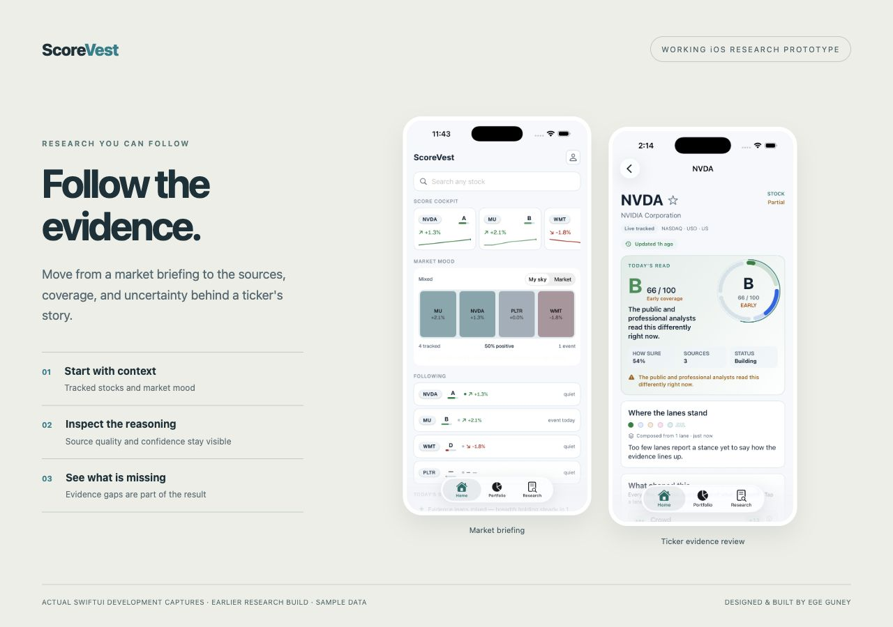
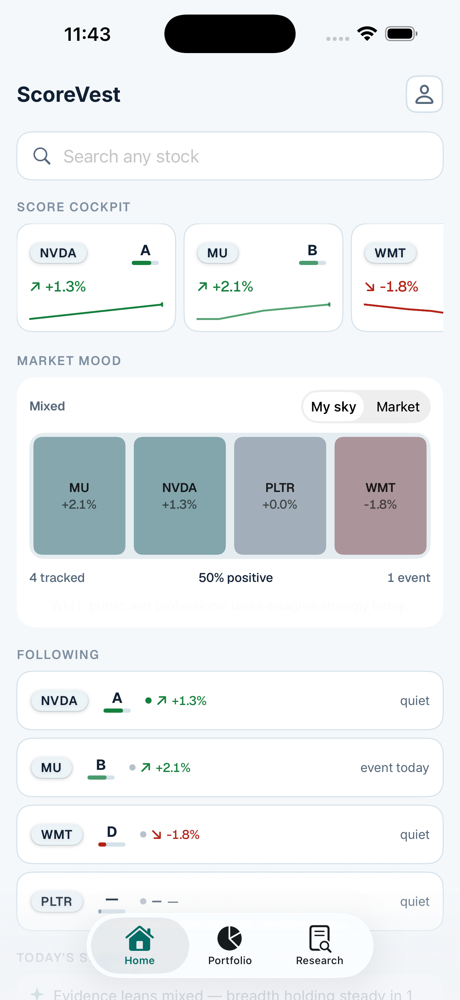
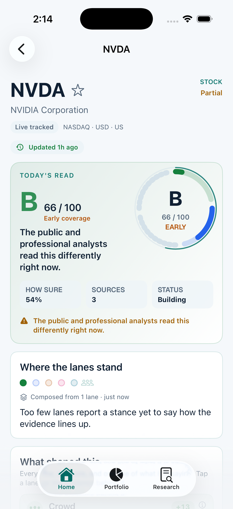
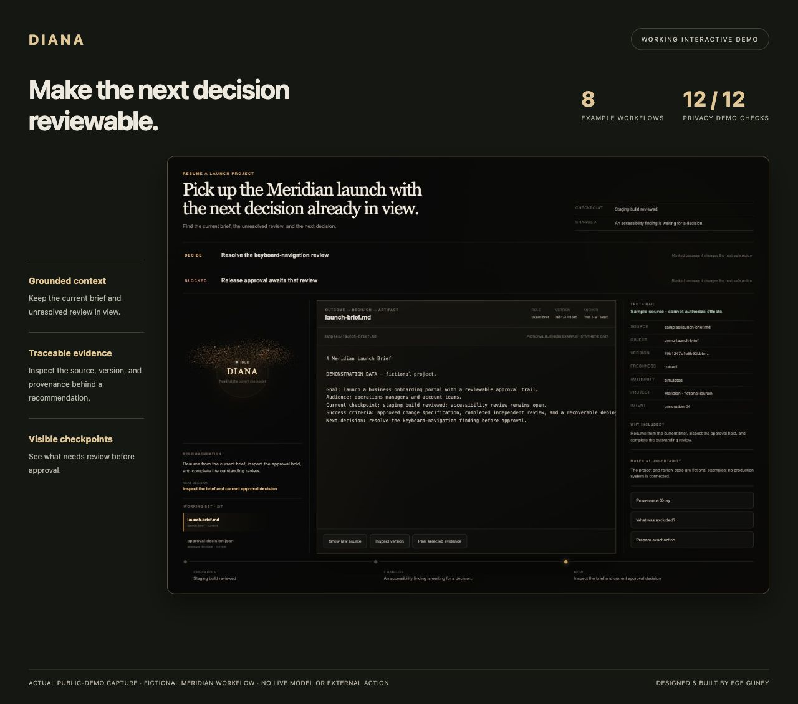
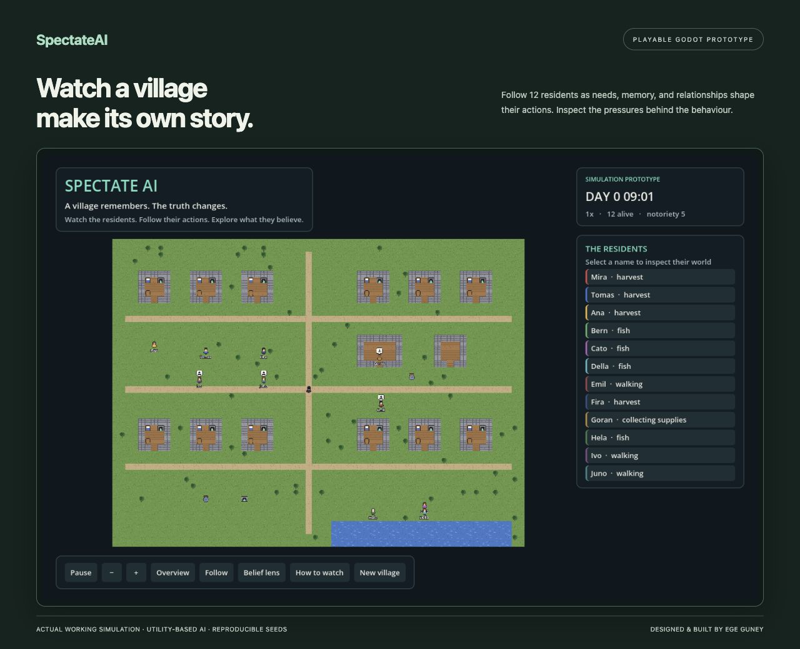
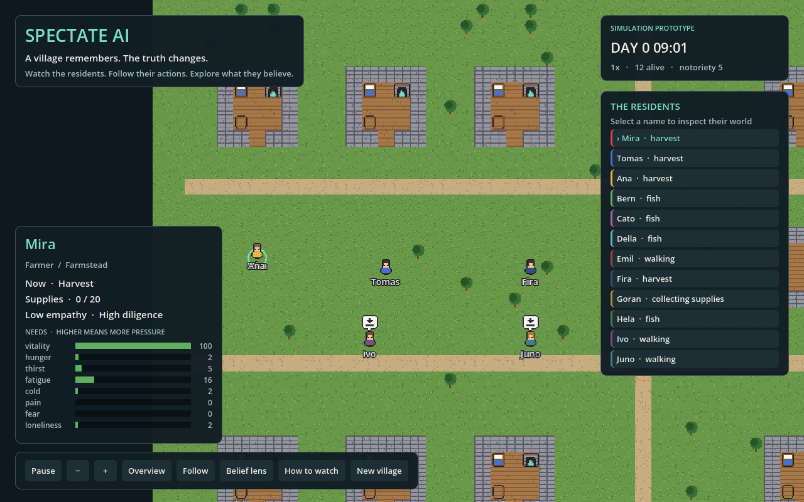
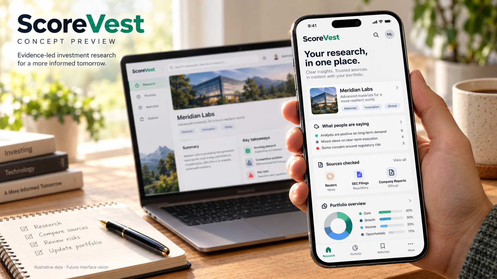
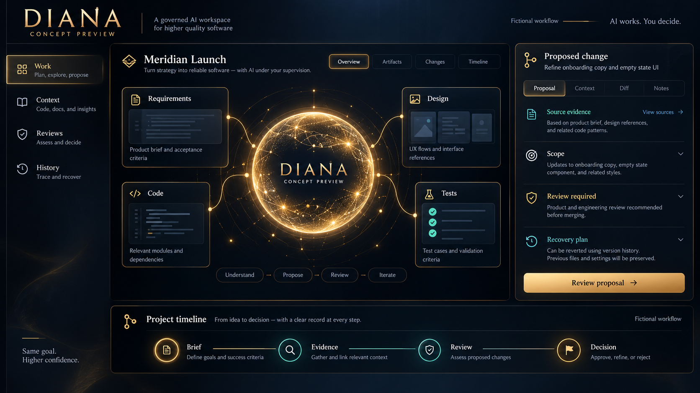
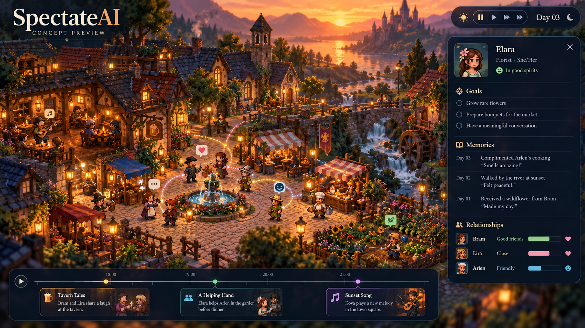

# Ege Guney — Project Showcase

**AI Engineering · Strategic Analytics**

A public portfolio connecting enterprise software experience with evidence-based financial research, governed AI interfaces, and inspectable multi-agent simulation.

**[Open the public showcase](https://ege-guney-project-showcase.cprkdtnm4v.chatgpt.site/)**

## Explore the projects

- **ScoreVest:** investment research and portfolio analytics combining cited sources, explicit evidence gaps, and cost-aware paper simulations. The public page is an overview; the application source remains private.
- **DIANA Preview:** an interactive Holo workspace showing evidence review, approval boundaries, source provenance, and recovery using entirely fictional Meridian workflows. The privacy workbench classifies sensitivity, redacts identifiers, and generates preview receipts locally.
- **SpectateAI:** a working Godot village simulation driven by needs, beliefs, traits, and relationships. Playback, follow, overview, and belief-lens controls make emergent behavior inspectable. The concept artwork presents a future visual direction; it does not represent implemented graphics or language-model features.

## Demo scope

DIANA is an interface and privacy prototype using synthetic examples. It is not connected to a live model, private ledger, or autonomous tools. SpectateAI currently uses utility-based AI; language-model integration is planned. ScoreVest does not display personal holdings or verified investment-performance claims.

## Local preview

Run `python3 rebuild-game.py` to restore the verified WebAssembly engine from the compressed source chunks, then serve `dist/` with any static HTTP server. Routes: `/`, `/diana/`, `/privacy/`, and `/spectate/`. Godot Web export requires WebAssembly and WebGL2.

To rebuild the DIANA interface, install the pinned dependencies in `diana-src/` and run `npm run build`. The SpectateAI build is exported from the private game source using Godot 4.7.1 with the Compatibility renderer and single-threaded Web export.

## Attribution

Designed and built by [Ege Guney](https://github.com/Ege-Guney). The SpectateAI future-direction artwork was generated with AI as a clearly labeled concept preview.

## Working prototype screenshots

These are actual application captures, presented with consistent framing and short workflow captions. The interface content is preserved.

### ScoreVest — research in a native iOS interface

Inspect the original iOS captures

<table><tr><td></td><td></td></tr><tr><td>Market briefing</td><td>Ticker evidence and uncertainty</td></tr></table>

*Actual iOS development captures from an earlier working research build. Home uses demo fixtures; market figures are sample development data.*

### DIANA — inspect evidence before approving work

*Captured from the public Holo demo with synthetic Meridian examples. [Full workspace](dist/images/diana-working-demo.jpg) · [Privacy workbench](dist/images/diana-privacy-demo.jpg).*

### SpectateAI — make agent behaviour observable

*Actual Godot prototype with 12 residents and interactive playback controls.*

Inspect a resident in the working demo

## Optional future concepts

These secondary AI-generated images explore possible future directions. They are separate from the working screenshots above.

Future ScoreVest design direction

*AI-generated concept. Illustrative data and proposed interface.*

Future DIANA design direction

*AI-generated concept. Fictional workflow and proposed interface.*

Future SpectateAI design direction

*AI-generated concept. Proposed graphics and interface.*

